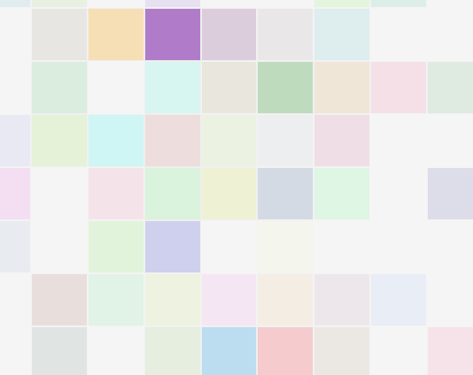

# gridAjustavel-Sketchpad
gridAjustavel para brincar de DOM

## o que é
Este é um projeto simples de um Sketchpad ou algo entre um bloco de desenho e uma Etch-A-Sketch. Ele permite que você desenhe ao passar o mouse sobre uma grade de quadrados, alterando suas cores e escurecendo-os progressivamente a cada interação.

